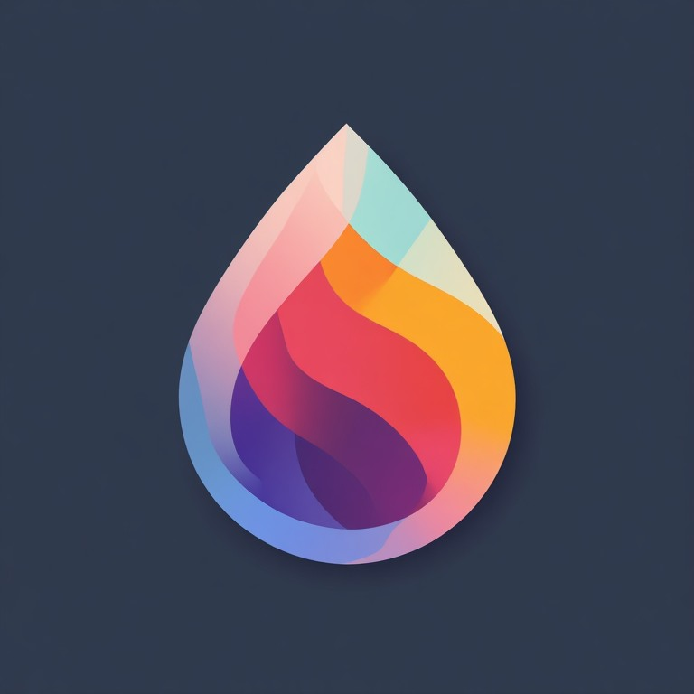
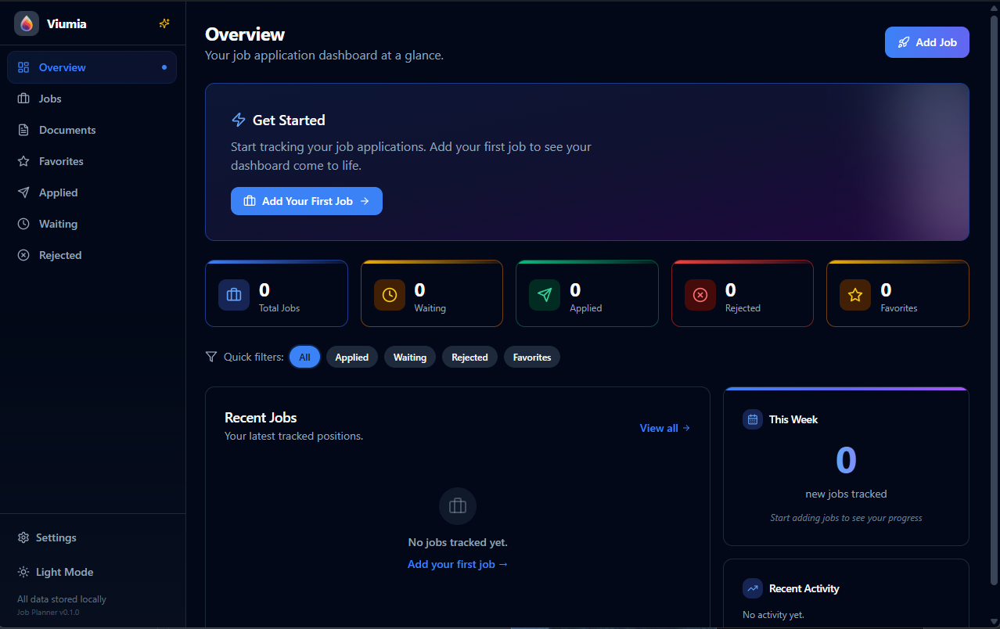
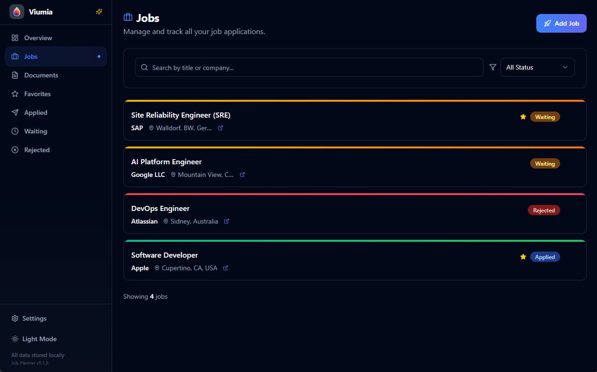
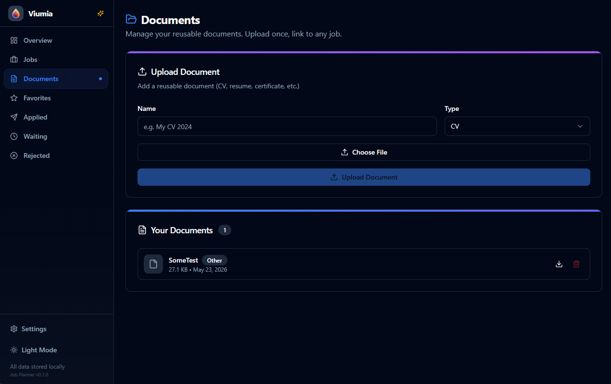
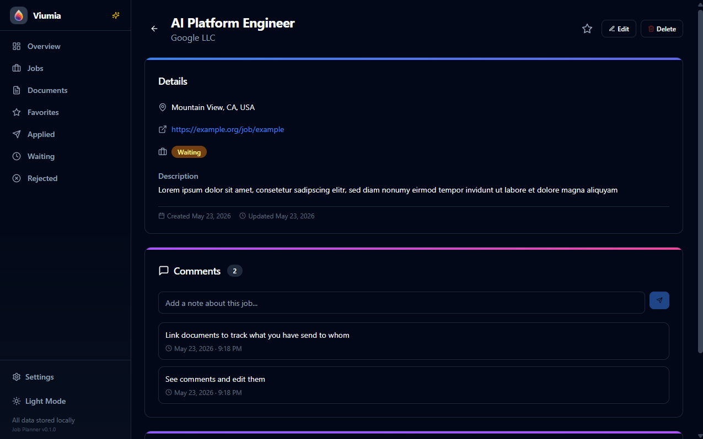

# Viumia — Smart Job Application Tracker

🌐 **[Visit the website](https://anonknowsit.github.io/viumia/)** &nbsp;|&nbsp; 📥 **[Download for Windows](https://github.com/anonknowsit/viumia/releases/latest)**

**Never lose track of a job application again.**

Viumia is a free, open-source desktop application that helps you organize your entire job search in one beautiful place. Track applications, manage documents, add notes, and visualize your progress — all while keeping your data 100% private and offline.

---

## Features

### Track Applications
Log every job you apply to with company name, role, location, status, and salary expectations. Filter and sort by:
- **Waiting** — Applications pending review
- **Applied** — Recently submitted applications
- **Rejected** — Applications that didn't work out
- **Favorites** — Jobs you want to prioritize

### Document Library
Upload your CVs, cover letters, certificates, and portfolios once. Link them to any job application without duplicate uploads. Keep everything organized and accessible.

### Notes & Comments
Add detailed interview notes, follow-up reminders, and personal comments to every job entry. Never forget important details from conversations or interviews.

### Statistics Dashboard
Visualize your job search progress with insightful charts showing:
- Applications over time
- Response rates
- Status breakdowns
- Favorite jobs count

### 100% Offline & Private
Your data stays on your machine. Period.
- SQLite database (local storage)
- No cloud sync
- No accounts required
- No tracking or analytics
- Fully private by design

### Backup & Restore
Export all your data as a ZIP backup and restore it anytime. Your job search history is always safe and portable.

### Favorites
Mark important jobs as favorites for quick access. Filter your view to see only your top-priority applications.

---

## Getting Started

### Download
Get the latest release for Windows:
- **[Download for Windows](https://github.com/anonknowsit/viumia/releases/latest)**

### System Requirements
- Windows 10 or later
- ~100 MB disk space
- No internet connection needed (after installation)
- No account or sign-up required

### Installation
1. Download the latest `.exe` installer from [Releases](https://github.com/anonknowsit/viumia/releases)
2. Run the installer
3. Launch Viumia and start organizing your job search!

---

## Technology Stack

Viumia is built with modern web technologies packaged as a native desktop application:

| Layer | Technology |
|-------|-----------|
| **Frontend** | React + TypeScript + TailwindCSS |
| **Backend** | Rust (Tauri) |
| **Database** | SQLite |
| **UI Components** | shadcn/ui |
| **Package Manager** | npm |
| **Build Tool** | Vite |

---

## Screenshots

### Overview
 

  

### Job Overview
 

  

### Document Library
 

  

### Job Detail & Notes
 

  

---

##  License

This project is licensed under a **Non-Commercial License** - see the [LICENSE](LICENSE) file for details. Commercial use is prohibited without explicit permission.

---

##  Support

-  **Report a bug**: [GitHub Issues](https://github.com/anonknowsit/viumia/issues)
-  **Request a feature**: [GitHub Discussions](https://github.com/anonknowsit/viumia/discussions)

---

**Made with ❤️ for job seekers everywhere.**

*Stop juggling spreadsheets and scattered files. Viumia keeps your entire job search organized in one place.*
